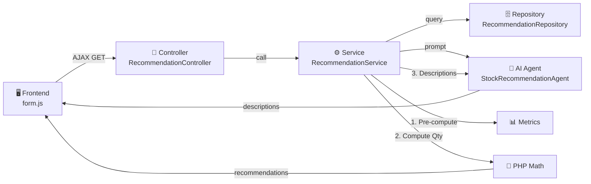
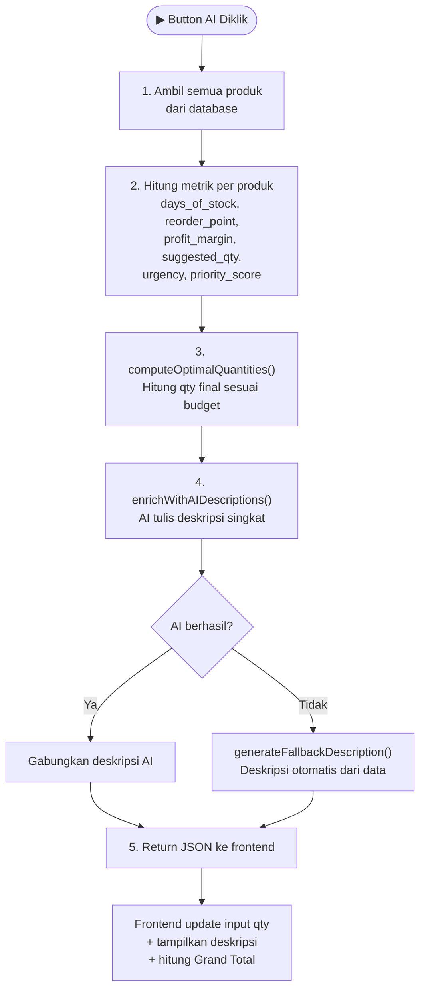
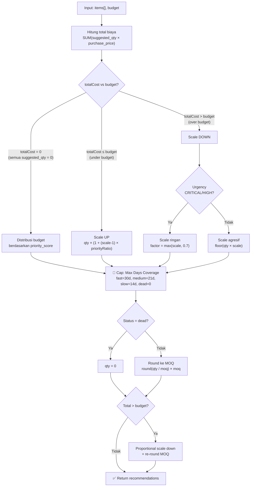
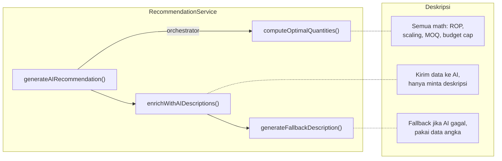
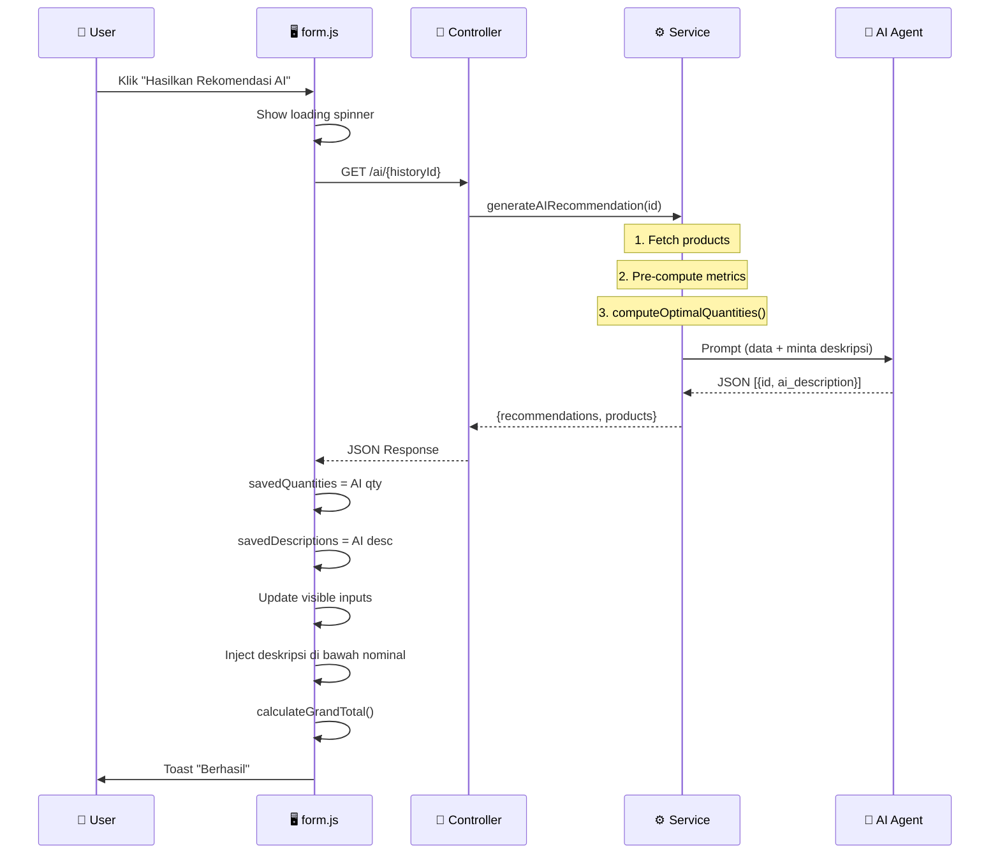

# 📦 Dokumentasi Sistem Rekomendasi Stok AI

> Referensi lengkap cara kerja fitur rekomendasi restock berbasis AI untuk developer baru.

---

## Arsitektur Keseluruhan



---

## Alur Utama `generateAIRecommendation()`



---

## Detail Algoritma `computeOptimalQuantities()`



---

## Formula Referensi

| Metrik | Formula | Fungsi |
|---|---|---|
| `days_of_stock` | `current_stock / avg_daily_sales` | Berapa hari stok bertahan |
| `reorder_point` | `ceil(avg_daily × lead_time)` | Kapan harus pesan |
| `safety_stock` | `ceil(avg_daily × lead_time)` | Buffer minimum |
| `suggested_qty` | `max(ROP + safety_stock - current_stock, 0)` → MOQ | Baseline reorder |
| `profit_margin` | `(sell_price - purchase_price) / sell_price` | Profitabilitas |
| `priority_score` | `(urgencyW × 2) + statusW + (margin × 5) + (score × 3)` | Bobot prioritas keseluruhan |

### Urgency Levels

| Level | Kondisi | Weight |
|---|---|---|
| 🔴 CRITICAL | Stok < 3 hari | 4 |
| 🟠 HIGH | Stok < 7 hari | 3 |
| 🟡 MEDIUM | Stok < 14 hari | 2 |
| 🟢 LOW | Stok ≥ 14 hari | 1 |

### Max Days Coverage (Anti Over-Order)

| Status | Max Hari | Contoh (laku 10/hari) |
|---|---|---|
| Fast | 30 hari | max 300 unit |
| Medium | 21 hari | max 210 unit |
| Slow | 14 hari | max 140 unit |
| Dead | 0 hari | 0 unit |

---

## Tanggung Jawab Tiap Method



| Method | File | Tugas |
|---|---|---|
| `generateAIRecommendation()` | `RecommendationService.php` | Orchestrator: pre-compute → qty → deskripsi |
| `computeOptimalQuantities()` | `RecommendationService.php` | Hitung qty (scaling, MOQ, budget cap) |
| `enrichWithAIDescriptions()` | `RecommendationService.php` | Panggil AI untuk deskripsi bahasa Indonesia |
| `generateFallbackDescription()` | `RecommendationService.php` | Deskripsi otomatis jika AI gagal |
| `getAiRecommendations()` | `RecommendationController.php` | API endpoint `/ai/{id}` |
| `applyAIToVisibleRows()` | `form.js` | Update input qty + inject deskripsi ke DOM |
| `calculateGrandTotal()` | `form.js` | Hitung total nominal semua halaman |

---

## Data Flow: Frontend ↔ Backend



---

## File Map

```
app/
├── Services/Report/
│   └── RecommendationService.php     ← Core logic (4 methods)
├── Http/Controllers/Report/
│   └── RecommendationController.php  ← API endpoint
├── Repositories/Report/
│   └── RecommendationRepository.php  ← Database queries
└── Agents/
    └── StockRecommendationAgent.php  ← AI agent config

resources/
├── js/pages/report/recommendation/
│   └── form.js                       ← Frontend handler
├── css/pages/report/recommendation/
│   └── form.css                      ← Styling (AI button, descriptions)
└── views/report/recommendation/
    └── form.blade.php                ← HTML template

database/
├── migrations/
│   └── *_create_stock_moving_details_table.php
└── seeders/
    └── RecommendationStockDetailSeeder.php
```

---

## Jaminan Sistem

| Jaminan | Cara Kerja |
|---|---|
| ✅ Total ≤ COGS Balance | PHP `computeOptimalQuantities()` + final budget cap |
| ✅ Qty = kelipatan MOQ | PHP `round(qty/moq) × moq` di setiap tahap |
| ✅ Tidak over-order | Max days coverage per status (fast=30, slow=14) |
| ✅ Dead stock = 0 | Hard-coded `qty = 0` untuk status dead |
| ✅ Tetap jalan tanpa AI | `generateFallbackDescription()` otomatis |
| ✅ Grand Total akurat | `editedNominalDifferences` track semua halaman |
